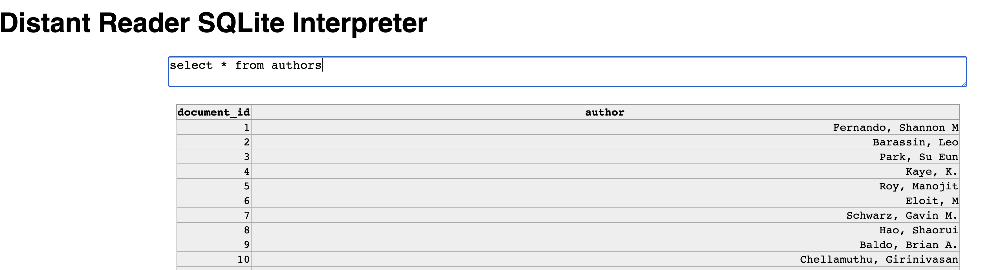

# Prerequisites
## Install dependencies
install node modules via yarn
1. npm install -g yarn
2. yarn install

## cord database
sqlite3 database placed in public/test.db

# Run Interpreter
yarn run

# Preview
Preview of the viewer running a query
