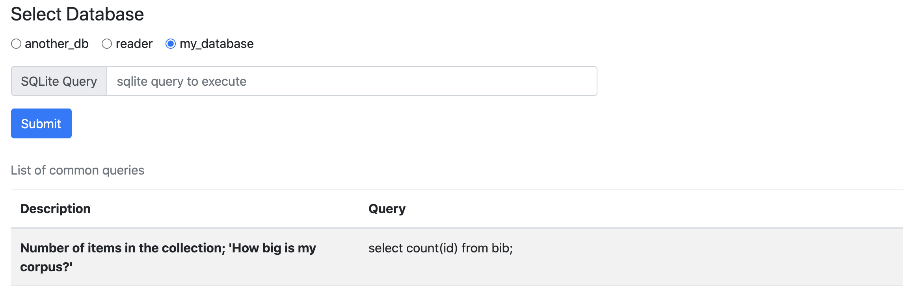

# Prerequisites
Python 3.X.X

## Cord Database
sqlite3 database placed in db_viewer_py/reader.db

# Run Webserver
./reader-toolbox/bin/start-httpd.sh

# Preview
Preview of the viewer running a query
